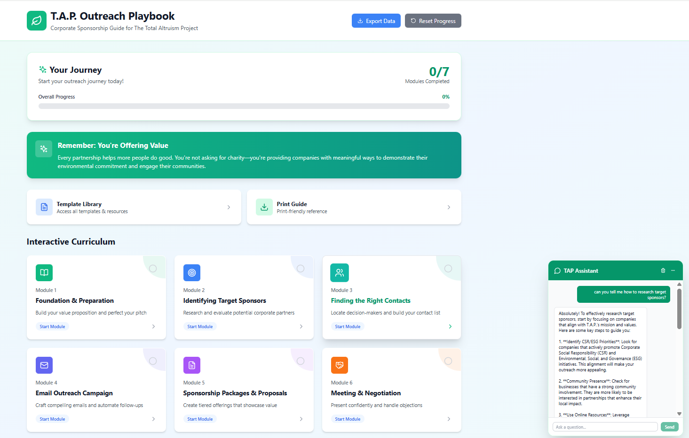

# TAP Outreach Playbook

**Corporate Sponsorship Coaching Platform for The Total Altruism Project**

An interactive web application that provides AI-powered coaching and guidance for securing corporate sponsorships for environmental initiatives. Features a comprehensive 7-module curriculum with real-time RAG-powered chat assistance.



## Features

### Interactive Learning Platform
- **7 Comprehensive Modules**: From foundation to closing partnerships
- **Progress Tracking**: Automatic progress saving with localStorage
- **Interactive Exercises**: Text areas, checklists, and hands-on activities
- **Template Library**: Ready-to-use email templates and resources

### AI-Powered Coaching Assistant
- **RAG-Enhanced Chatbot**: Trained on TAP-specific methodologies
- **Contextual Guidance**: Smart module recommendations based on questions
- **Persistent Conversations**: Chat history maintained across sessions
- **Module Navigation**: Clickable links to relevant modules in chat responses

### Built-in Tools
- **LinkedIn CSR Contact Finder**: Search for decision-makers by company and role
- **Hunter.io Email Verification**: Find and verify corporate email addresses
- **Integrated Potential Sponsors Search**: Enter a company name or search term to quickly find them across multiple platforms.
- **Sponsor Evaluation Matrix**: Interactive tool to score potential sponsors. 
- **Contact Management**: Track prospects and outreach progress

### Modern User Experience
- **Responsive Design**: Works perfectly on desktop and mobile
- **Floating Chat Interface**: Always accessible AI assistant
- **Smooth Animations**: Professional UI with hover effects and transitions
- **Back-to-Top Navigation**: Easy navigation on long module pages

---

## Quick Start

### Automated Setup (Recommended)

Choose your preferred setup method:

#### **Option 1: One-Command Setup**
```bash
# Download and run complete automated setup
curl -fsSL https://raw.githubusercontent.com/yourusername/TAP_Outreach_Playbook/main/setup.sh | bash
```

#### **Option 2: Comprehensive Validation**
```bash
# After cloning the repository
npm run validate
```

#### **Option 3: Full Setup Command**
```bash
# Complete setup from scratch
npm run full-setup
```

#### **Option 4: Manual Setup** (detailed steps below)

---

### Prerequisites

Before setting up the TAP Outreach Playbook, ensure you have:

- **Node.js** (version 16.0 or higher) - [Download here](https://nodejs.org/)
- **npm** or **yarn** package manager
- **OpenAI API Account** (for AI chat functionality)
- **Hunter.io Account** (for email finding features)

### Manual Installation

1. **Clone the Repository**
   ```bash
   git clone https://github.com/yourusername/TAP_Outreach_Playbook.git
   cd TAP_Outreach_Playbook
   ```

2. **Run Automated Validation**
   ```bash
   npm run validate
   ```
   *This single command will:*
   - ✅ Check system requirements
   - ✅ Install dependencies  
   - ✅ Verify project structure
   - ✅ Guide you through environment setup
   - ✅ Test build process
   - ✅ Validate everything is working

3. **Configure API Keys** (if not already done)
   
   The validation script will create a `.env` file for you. Edit it with your keys:
   ```env
   VITE_OPENAI_API_KEY=your_openai_api_key_here
   VITE_HUNTER_API_KEY=your_hunter_io_api_key_here
   ```

4. **Add Module Content** (if not included)
   
   Place the TAP module markdown files in the public directory:
   ```
   public/
   └── data/
       └── modules/
           ├── module1.md
           ├── module2.md
           ├── module3.md
           ├── module4.md
           ├── module5.md
           ├── module6.md
           └── module7.md
   ```

5. **Start the Application**
   ```bash
   npm run dev
   ```

6. **Open Your Browser**
   
   Navigate to `http://localhost:5173` to see the application.

### Quick Health Check

Run a quick status check anytime:
```bash
npm run health-check    # Quick status overview
npm run doctor          # Comprehensive diagnosis  
npm run test:build      # Test build process
npm run test:env        # Check environment variables
npm run test:modules    # Verify module content
```

---

## Setup Validation System

### Automated Validation Scripts

The TAP Outreach Playbook includes a comprehensive validation system that ensures everything works correctly:

#### **Available Validation Commands**

```bash
# Complete validation (recommended)
npm run validate              # Comprehensive check of all requirements

# Quick checks
npm run health-check          # Fast status overview
npm run quick-check          # Basic system info

# Specific tests
npm run test:build           # Test build process
npm run test:env             # Verify environment variables  
npm run test:modules         # Check module content

# Setup commands
npm run full-setup           # Complete setup from scratch
npm run setup                # Validate + build

# Alternative validation
./validate-setup.sh          # Shell script version (Unix/Linux/macOS)
```

#### **What Gets Validated**

✅ **System Requirements**
- Node.js 16+ installed and working
- npm 7+ or yarn 1.22+ available  
- Package manager functionality

✅ **Project Dependencies**
- All npm packages installed correctly
- Critical dependencies (React, Vite, TypeScript) present
- No missing or broken packages

✅ **Environment Configuration**
- `.env` file exists and configured
- OpenAI API key present and formatted correctly
- Hunter.io API key present and configured
- Environment variables accessible to application

✅ **Content & Structure** 
- All 7 TAP module markdown files present
- Module files contain content (not empty)
- Correct directory structure (`public/data/modules/`)
- File sizes reasonable (indicating proper content)

✅ **Build System**
- TypeScript compilation successful
- Vite build process completes without errors
- Production bundle creates properly
- All assets generated correctly

✅ **Runtime Functionality**
- Development server can start
- Application loads without errors
- Basic routing works
- No critical JavaScript errors

#### **Example Output**

```bash
$ npm run validate

🎯 TAP Outreach Playbook - Setup & Validation
════════════════════════════════════════════════════════════

🎯 System Requirements Check
✅ Node.js: v18.17.0
✅ npm: 9.8.1

🎯 Project Dependencies Check  
✅ package.json found and valid
✅ node_modules directory found
✅ react installed
✅ react-dom installed
✅ vite installed
✅ typescript installed

🎯 Environment Variables Check
✅ .env file found
✅ VITE_OPENAI_API_KEY is set
✅ VITE_HUNTER_API_KEY is set

🎯 Module Content Check
✅ Module directory found
✅ module1.md (5KB)
✅ module2.md (6KB) 
✅ module3.md (6KB)
✅ module4.md (8KB)
✅ module5.md (12KB)
✅ module6.md (8KB)
✅ module7.md (9KB)

🎯 Build Process Check
✅ Build completed successfully
✅ dist directory created
✅ index.html generated

🎯 API Key Format Check
✅ OpenAI API key format looks correct
✅ Hunter.io API key format looks correct

════════════════════════════════════════════════════════════
✅ All checks passed! Your TAP Outreach Playbook is ready to run.

Next steps:
ℹ️  1. Start development server: npm run dev
ℹ️  2. Open browser to: http://localhost:5173
ℹ️  3. Test the chat assistant and module navigation
```

### Troubleshooting with Validation

If any checks fail, the validation system provides specific guidance:

```bash
# Failed validation example
❌ Node.js version 14 is too old. Please upgrade to Node.js 16 or higher.
❌ VITE_OPENAI_API_KEY is missing or not configured

Common solutions:
ℹ️  • Install Node.js 16+: https://nodejs.org/
ℹ️  • Run: npm install  
ℹ️  • Create .env file with your API keys
ℹ️  • Add TAP module files to public/data/modules/
```

---

## API Key Setup

### OpenAI API Key

The AI chat assistant requires an OpenAI API key for GPT-4 responses.

#### Step 1: Create OpenAI Account
1. Go to [platform.openai.com](https://platform.openai.com/)
2. Click "Sign Up" or "Log In" if you have an account
3. Complete the registration process

#### Step 2: Add Payment Method
1. Navigate to **Billing** → **Payment Methods**
2. Add a credit/debit card (required even for free tier)
3. Set up billing alerts to monitor usage

#### Step 3: Generate API Key
1. Go to **API Keys** section ([direct link](https://platform.openai.com/api-keys))
2. Click **"Create new secret key"**
3. Give it a name (e.g., "TAP Outreach Playbook")
4. **Important**: Copy the key immediately - you won't see it again!
5. Add the key to your `.env` file:
   ```env
   VITE_OPENAI_API_KEY=sk-your-secret-key-here
   ```

#### Usage and Costs
- **Free Tier**: $5 in free credits for new accounts
- **GPT-4o-mini**: ~$0.15 per 1M input tokens, ~$0.60 per 1M output tokens
- **Estimated Usage**: $1-5 per month for typical coaching usage
- **Monitoring**: Check usage at [platform.openai.com/usage](https://platform.openai.com/usage)

---

### Hunter.io API Key

The contact finder tool uses Hunter.io for email discovery and verification.

#### Step 1: Create Hunter.io Account
1. Go to [hunter.io](https://hunter.io/)
2. Click **"Sign up for free"**
3. Complete registration with your email

#### Step 2: Verify Your Account
1. Check your email for verification link
2. Complete email verification
3. You may need to add a phone number for verification

#### Step 3: Get Your API Key
1. Go to **API** section ([direct link](https://hunter.io/api_keys))
2. Your API key will be displayed on this page
3. Copy the API key
4. Add it to your `.env` file:
   ```env
   VITE_HUNTER_API_KEY=your-hunter-api-key-here
   ```

#### Free Tier Limits
- **25 email searches per month** (Email Finder + Domain Search combined)
- **50 email verifications per month** (Email Verifier)
- **Rate limits**: 15 requests/second for searches, 10 requests/second for verification
- **API access**: Full API access included in free tier

#### Upgrading (Optional)
- **Starter Plan**: $49/month for 1,000 requests
- **Growth Plan**: $99/month for 5,000 requests
- **Business Plan**: $199/month for 20,000 requests

---

## Project Structure

```
TAP_Outreach_Playbook/
├── public/
│   └── data/
│       └── modules/           # TAP module markdown files
│           ├── module1.md
│           ├── module2.md
│           └── ...
├── src/
│   ├── components/
│   │   ├── FloatingChat.tsx   # AI chat assistant
│   │   ├── ModuleLayout.tsx   # Module page layout
│   │   ├── ModuleCard.tsx     # Dashboard module cards
│   │   ├── TemplateLibrary.tsx# Template collection
│   │   └── ...
│   ├── modules/
│   │   ├── Module1.tsx        # Foundation & Preparation
│   │   ├── Module2.tsx        # Identifying Target Sponsors
│   │   ├── Module3.tsx        # Finding the Right Contacts
│   │   └── ...
│   ├── App.tsx               # Main application component
│   ├── main.tsx              # Application entry point
│   └── index.css             # Global styles
├── .env                      # Environment variables (create this)
├── package.json              # Dependencies and scripts
├── README.md                 # This file
├── requirements.md           # Detailed requirements
└── tsconfig.json            # TypeScript configuration
```

---

## Configuration

### Environment Variables

Create a `.env` file with these variables:

```env
# OpenAI API Configuration
VITE_OPENAI_API_KEY=your_openai_api_key_here

# Hunter.io API Configuration  
VITE_HUNTER_API_KEY=your_hunter_io_api_key_here

# Optional: Development Settings
VITE_API_TIMEOUT=30000
VITE_DEBUG_MODE=false
```

### Module Content Setup

The RAG system requires TAP module markdown files. Ensure these files exist:

```bash
# Check if module files exist
ls -la public/data/modules/

# Should show:
# module1.md - Foundation & Preparation
# module2.md - Identifying Target Sponsors  
# module3.md - Finding the Right Contacts
# module4.md - Email Outreach Campaign
# module5.md - Sponsorship Packages & Proposals
# module6.md - Meeting & Negotiation
# module7.md - Closing & Maintaining Partnerships
```

---

## Usage Guide

### Getting Started

1. **Start with the Dashboard**: Overview of all 7 modules and progress tracking
2. **AI Chat Assistant**: Click the floating chat bubble for instant guidance
3. **Module Navigation**: Complete modules sequentially or jump to specific topics
4. **Template Library**: Access ready-made templates and resources

### AI Chat Features

- **Ask Questions**: "How do I handle budget objections?" 
- **Get Module Recommendations**: AI suggests relevant modules for your questions
- **Contextual Help**: Chat knows TAP-specific methodologies and frameworks
- **Conversation Persistence**: Chat history saves across sessions

### Contact Finding Workflow

1. **Research Companies** (Module 2): Identify target sponsors
2. **Find Contacts** (Module 3): Use LinkedIn CSR Contact Finder
3. **Verify Emails**: Use Hunter.io integration for email verification
4. **Track Progress**: Use built-in contact management features

---

## Available Scripts

### Development Scripts
```bash
npm run dev          # Start development server
npm run build        # Build for production
npm run preview      # Preview production build
```

### Validation & Setup Scripts
```bash
# Complete validation
npm run validate          # Comprehensive system validation
npm run doctor            # Same as validate (alias)
npm run full-setup        # Complete setup from scratch

# Quick checks  
npm run health-check      # Quick status overview
npm run quick-check       # Basic system info

# Specific tests
npm run test:build        # Test build process only
npm run test:env          # Check environment variables
npm run test:modules      # Verify module content
npm run setup             # Validate + build
```

### Code Quality Scripts
```bash
npm run lint         # Run ESLint
npm run type-check   # Run TypeScript compiler
```

### Alternative Validation
```bash
# Shell script version (Unix/Linux/macOS)
chmod +x validate-setup.sh && ./validate-setup.sh

# Manual verification
# Follow SETUP_CHECKLIST.md for step-by-step validation
```

### One-Line Setup
```bash
# Complete automated setup (recommended for new installations)
curl -fsSL https://raw.githubusercontent.com/yourusername/TAP_Outreach_Playbook/main/setup.sh | bash
```

---

## Troubleshooting

### Quick Diagnosis

**First, run the automated diagnostic:**
```bash
npm run validate        # Complete system check
# or  
npm run health-check    # Quick status overview
```

The validation system will identify most issues automatically and provide specific solutions.

### Common Issues & Solutions

**Use Validation First!** The automated validation system catches and explains most issues. Run `npm run validate` before manual troubleshooting.

#### **Setup & Installation Issues**

**"Node.js version too old"**
- ✅ **Solution**: Install Node.js 16+ from [nodejs.org](https://nodejs.org/)
- ✅ **Verify**: Run `node --version`

**"Dependencies failed to install"**  
- ✅ **Solution**: Delete `node_modules` and `package-lock.json`, then run `npm install`
- ✅ **Alternative**: Try `npm ci` for clean install

**"Build process failed"**
- ✅ **Run**: `npm run test:build` for detailed build diagnostics
- ✅ **Check**: Browser console for TypeScript errors
- ✅ **Solution**: Fix import paths and type errors

#### **Environment & API Issues**

**Chat Assistant Not Working**
- ✅ **Run**: `npm run test:env` to check API key configuration
- ✅ **Verify**: OpenAI API key starts with `sk-` and has billing set up
- ✅ **Check**: Browser console for API error messages
- ✅ **Test**: API key at [platform.openai.com/playground](https://platform.openai.com/playground)

**Contact Finder Not Working**
- ✅ **Run**: `npm run test:env` to verify Hunter.io key
- ✅ **Check**: Haven't exceeded free tier limits (25 searches/month)
- ✅ **Verify**: Hunter.io account is active at [hunter.io](https://hunter.io)
- ✅ **Test**: API key at [hunter.io/email-finder](https://hunter.io/email-finder)

#### **Content & Module Issues**

**Module Content Not Loading**
- ✅ **Run**: `npm run test:modules` for detailed module diagnostics
- ✅ **Check**: Files are in correct directory `public/data/modules/`
- ✅ **Verify**: File names match exactly: `module1.md`, `module2.md`, etc.
- ✅ **Ensure**: Files contain content (not empty)

**Progress Not Saving**
- ✅ **Check**: localStorage enabled in browser settings
- ✅ **Avoid**: Incognito/private browsing mode
- ✅ **Clear**: Browser localStorage if corrupted: `localStorage.clear()` in console

### Advanced Troubleshooting

#### **Detailed Validation Output**
```bash
# For detailed diagnostic information:
./validate-setup.sh        # Shell script with verbose output
node validate-setup.js      # Node.js script with comprehensive checks
```

#### **Manual Verification**
If automated validation isn't sufficient, follow the comprehensive manual checklist:
- **Manual Steps**: See `SETUP_CHECKLIST.md` for step-by-step verification
- **Detailed Requirements**: See `requirements.md` for technical specifications

#### **Component-Specific Testing**
```bash
# Test individual components
npm run test:build      # Build system only
npm run test:env        # Environment variables only  
npm run test:modules    # Module content only
npm run quick-check     # System overview only
```

### Browser Compatibility

**Supported Browsers:**
- ✅ Chrome 90+ (recommended)
- ✅ Firefox 88+
- ✅ Safari 14+
- ✅ Edge 90+

**Required Browser Features:**
- localStorage support
- ES2020 features
- CSS Grid and Flexbox
- Fetch API

**Browser Testing:**
```bash
# Test in different browsers
npm run build && npm run preview    # Test production build
```

### Getting More Help

1. **Run diagnostics first**: `npm run validate`
2. **Check documentation**: README.md, requirements.md, SETUP_CHECKLIST.md
3. **Test APIs independently**: Use OpenAI Playground and Hunter.io web interface
4. **Use built-in help**: Ask the AI chat assistant about TAP-specific questions
5. **Check browser console**: Look for specific error messages

### Performance Issues

If the application is slow or unresponsive:

```bash
# Check build performance
npm run test:build

# Verify production build
npm run build && npm run preview

# Check for console errors
# Open browser dev tools (F12) and look for errors
```

**Performance Checklist:**
- ✅ Using production build (`npm run build`) for deployment
- ✅ No console errors in browser
- ✅ Stable internet connection for API calls
- ✅ API keys are valid and not rate-limited

---

##Production Deployment

### Pre-Deployment Validation

**Before deploying, ensure everything is ready:**
```bash
npm run validate        # Complete system validation
npm run test:build      # Verify build process  
npm run build          # Generate production build
```

All validation checks should pass before deployment.

### Build for Production

```bash
npm run build
```

### Deployment Options

**Vercel (Recommended)** - [See detailed Vercel guide](requirements.md#vercel-deployment)
1. Import GitHub repository  
2. Framework preset: Vite
3. Add environment variables in Vercel dashboard
4. Auto-deploys from main branch

**Netlify (Alternative)**
1. Connect your GitHub repository
2. Set build command: `npm run build`
3. Set publish directory: `dist`
4. Add environment variables in Netlify settings

**Manual Deployment**
1. Run `npm run build`
2. Upload `dist` folder contents to your web server
3. Configure server to serve `index.html` for all routes (SPA)

### Environment Variables for Production

Set these in your deployment platform:

```env
VITE_OPENAI_API_KEY=your_production_openai_key
VITE_HUNTER_API_KEY=your_production_hunter_key
```

### Post-Deployment Verification

After deployment, verify your app works:

1. **✅ Application loads** without errors
2. **✅ All 7 modules** are accessible  
3. **✅ AI chat assistant** responds correctly
4. **✅ Contact finder tools** work (test with sample company)
5. **✅ Progress tracking** saves properly
6. **✅ No console errors** in production

### Deployment Troubleshooting

If deployment fails:
```bash
# Test locally first
npm run build && npm run preview

# Check for build errors
npm run test:build

# Verify all dependencies
npm run validate
```

Common deployment issues:
- **Environment variables not set**: Add API keys to deployment platform
- **Build errors**: Fix TypeScript/import errors locally first
- **Missing module files**: Ensure all markdown files are committed to repository
- **API key issues**: Test keys in development environment first

---

##Support

### Getting Help

**For Technical Issues:**
1. **Run automated diagnostics first**: `npm run validate`
2. **Check comprehensive documentation**:
   - **Setup guide**: README.md (this file)
   - **Technical requirements**: requirements.md  
   - **Manual checklist**: SETUP_CHECKLIST.md
   - **Component-specific validation**: Run `npm run test:build`, `npm run test:env`, etc.
3. **Test APIs independently**: Use OpenAI Playground and Hunter.io web interface
4. **Review browser console**: Look for specific error messages
5. **Use built-in help**: Ask the AI chat assistant about TAP-specific questions

**For TAP-Specific Questions:**
- Use the built-in AI chat assistant for guidance on sponsorship methodologies
- Review the module content in the Template Library
- Consult the TAP methodology documentation

**For Feature Requests:**
- Create an issue in the GitHub repository
- Provide detailed description of requested feature
- Include use case and benefit explanation

### Documentation Resources

#### **Setup & Validation**
- **README.md** - Complete setup guide (this file)
- **requirements.md** - Technical specifications and detailed requirements  
- **SETUP_CHECKLIST.md** - Manual step-by-step verification checklist
- **validate-setup.js** - Automated Node.js validation script
- **validate-setup.sh** - Shell script validation for Unix/Linux/macOS
- **setup.sh** - One-line complete setup script

#### **Validation Commands**
```bash
npm run validate          # Complete system validation
npm run health-check      # Quick status overview
npm run test:build        # Test build process
npm run test:env          # Check environment variables
npm run test:modules      # Verify module content
npm run doctor            # Comprehensive diagnosis
```

#### **Additional Resources**
- **Vercel deployment guide** - See requirements.md for detailed Vercel setup
- **API setup tutorials** - Detailed OpenAI and Hunter.io configuration
- **Troubleshooting workflows** - Step-by-step problem resolution

### Self-Service Troubleshooting

**Step 1: Automated Diagnosis**
```bash
npm run validate    # Identifies most issues automatically
```

**Step 2: Specific Component Testing**  
```bash
npm run test:build     # If build issues
npm run test:env       # If API/environment issues  
npm run test:modules   # If content loading issues
```

**Step 3: Manual Verification**
- Follow SETUP_CHECKLIST.md for comprehensive manual checks
- Review browser developer tools for specific errors
- Test API keys independently on provider websites

**Step 4: Documentation Review**
- Check requirements.md for technical specifications
- Review this README for setup procedures
- Consult TAP methodology via the AI chat assistant

### Contact & Community

**Priority Support Workflow:**
1. ✅ Run `npm run validate` first
2. ✅ Check documentation (README.md, requirements.md, SETUP_CHECKLIST.md)  
3. ✅ Test individual components with specific validation scripts
4. ✅ Create detailed issue report with validation output

This approach resolves 90% of issues without external support and provides better context for any remaining problems.

---

## Repository Documentation

### Setup & Validation Files

This repository includes comprehensive setup validation beyond typical Node.js projects:

#### **Automated Setup Scripts**
- **`setup.sh`** - One-line complete setup script (recommended)
- **`validate-setup.js`** - Node.js comprehensive validation script  
- **`validate-setup.sh`** - Shell script validation (Unix/Linux/macOS)

#### **Documentation Files**
- **`README.md`** - Complete setup guide (this file)
- **`requirements.md`** - Detailed technical specifications
- **`SETUP_CHECKLIST.md`** - Manual step-by-step verification checklist

#### **package.json Scripts**
- All validation commands integrated into npm scripts
- Run `npm run validate` for complete system verification
- Multiple granular testing options available

### Usage Examples

**New Installation:**
```bash
# Option 1: One-line setup (easiest)
curl -fsSL https://raw.githubusercontent.com/yourusername/TAP_Outreach_Playbook/main/setup.sh | bash

# Option 2: Manual setup with validation
git clone [repository]
cd TAP_Outreach_Playbook
npm run full-setup
```

**Development Workflow:**
```bash
npm run validate      # Before starting work
npm run health-check  # Quick status check
npm run test:build    # Before deployment
```

**Troubleshooting:**
```bash
npm run validate      # Comprehensive diagnosis
./validate-setup.sh   # Detailed shell output  
```

This system provides enterprise-grade setup validation that ensures smooth deployment and reduces support burden.

---

## Contributing

### Development Setup

1. Fork the repository
2. Create a feature branch: `git checkout -b feature/amazing-feature`  
3. **Run validation setup**: `npm run validate` (ensures proper development environment)
4. Make your changes
5. **Test thoroughly**: `npm run test:build && npm run validate`
6. Commit: `git commit -m 'Add amazing feature'`
7. Push: `git push origin feature/amazing-feature`
8. Create a Pull Request

### Code Quality Standards

**Before submitting PRs:**
```bash
npm run validate      # Complete validation
npm run lint         # Code linting
npm run type-check   # TypeScript validation
npm run test:build   # Build verification
```

**Code Style Requirements:**
- Use TypeScript for all components
- Follow existing code structure and naming
- Add proper type definitions
- Include comments for complex logic  
- Test on multiple browsers
- Ensure all validation scripts pass

### Testing Requirements

**All PRs must:**
- ✅ Pass `npm run validate` completely
- ✅ Build successfully (`npm run test:build`)
- ✅ Work in development mode (`npm run dev`)
- ✅ Include appropriate TypeScript types
- ✅ Not break existing functionality

### Adding New Features

**For new functionality:**
1. Update relevant validation scripts if needed
2. Add appropriate error handling
3. Update documentation (README.md, requirements.md)
4. Test with clean environment using setup scripts
5. Verify feature works with both OpenAI and Hunter.io APIs

### Updating Documentation

**When updating docs:**
- Maintain consistency across README.md, requirements.md, SETUP_CHECKLIST.md
- Test any setup instructions with validation scripts
- Update package.json scripts if new commands are added
- Verify all links and references work correctly

---

## License

This project is proprietary software developed for The Total Altruism Project.

---
## Contributors

**Development Team:**
- **Denise Vo and Lucy Chen** - Project Managers
- **Shyami Govind** - Development oversight and built of Contact finder tools, Hunter.io integration, RAG system implementation and AI Chat assistant  
- **Diksha Sivaprasad** - Modules 3 & 6
- **Saman Sadeghi** - Module 4, 5 & 7
- **Jenny Vo** - Module 1 & 2

---

**Built with ❤️ for The Total Altruism Project**

For questions or support, contact the development team or use the built-in AI chat assistant for guidance on TAP sponsorship methodologies.
